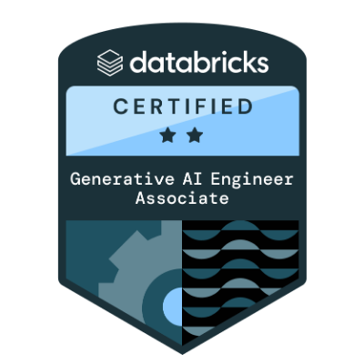

  

<table>
<tr>
<td width="220" valign="middle" align="center">
  
</td>

<td valign="top">

# Rupin Mehra

Software Engineer with experience building enterprise-scale web applications, Generative AI systems, Retrieval-Augmented Generation (RAG) pipelines, and cloud-native solutions. Passionate about creating intelligent software that delivers measurable business impact.

</td>
</tr>
</table>

## Currently...

🧠 Recently focussing on Artificial Intelligence and Machine Learning to expand my knowledge and stay up to date with upcoming technologies.

📚 Reading [The 1% Rule: How to Fall in Love with the Process and Achieve Your Wildest Dreams](https://app.thestorygraph.com/books/e032e483-9c9e-4366-a41f-a8fc01a9adf2).

## Experience 💼

Currently working as a <b><i>Software Engineer @ Spectrio </i></b>

I have previously worked as:

- a <b><i>Software Developer at the Naralytics</i></b> where I built an application and UI components using React Native, leveraging its versatility across both iOS and Android platforms, resulting in a seamless user experience. Alongside, I developed a NLP BERT model for data labeling and classification, enabling accurate and specific psychometric assessments across various use cases within the app.
- a <b><i>Software Engineer Intern at Elucidata</i></b> where I developed and maintained software systems and computing infrastructure utilizing Java, JavaScript, and SQL, while effectively identifying and resolving defects through troubleshoots, supporting data architecture, and generating reports.

## Skills 📐

## Stats 📈

> "Hardwork beats talent, when talent dosen't work hard."  - **Marius Minea (Proffessor at UMass Amherst)**

## Thanks 🙏

[alexandresanlim/Badges4-README.md-Profile](https://github.com/alexandresanlim/Badges4-README.md-Profile)

[anuraghazra/github-readme-stats](https://github.com/anuraghazra/github-readme-stats)

[DenverCoder1/readme-typing-svg](https://github.com/DenverCoder1/readme-typing-svg)

[simple-icons/simple-icons](https://github.com/simple-icons/simple-icons)

[tandpfun/skill-icons](https://github.com/tandpfun/skill-icons)

